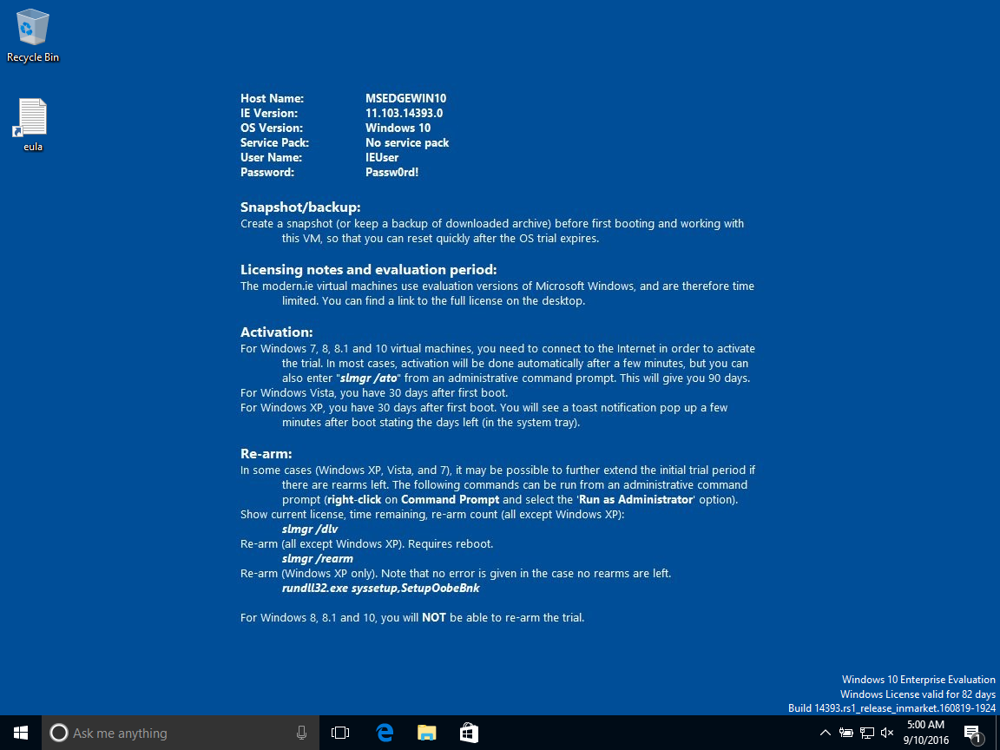
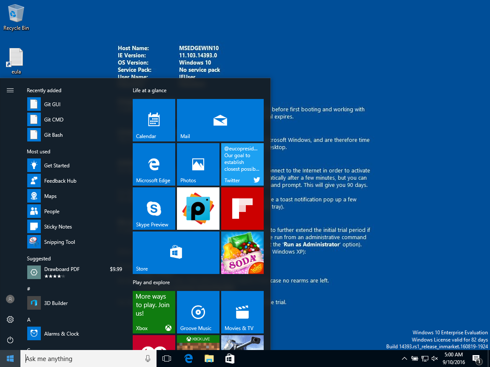
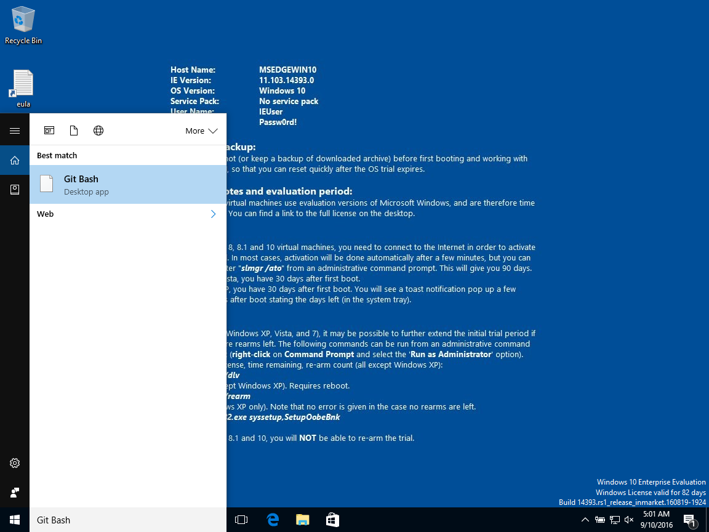
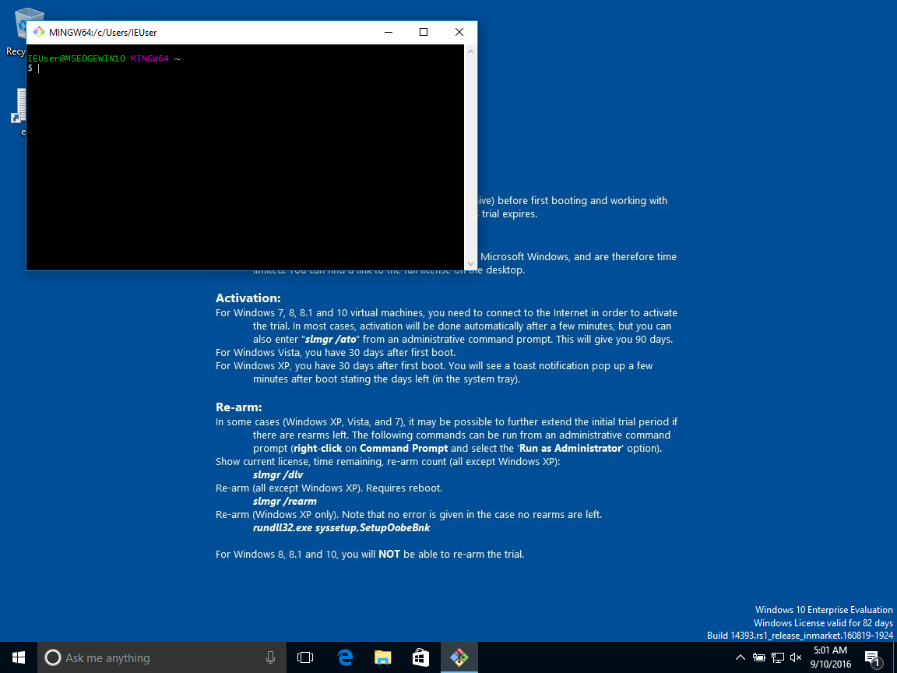

On Windows 10, you will start with a screen like the one below.

Press the [Windows key](https://en.wikipedia.org/wiki/Windows_key) on your keyboard the start menu or click on the bottom left corner of your screen.

Type `Git Bash` to filter the applications.

You can click on the only application listed, i.e. Git Bash.
After a few seconds you will get a new window with your terminal.

