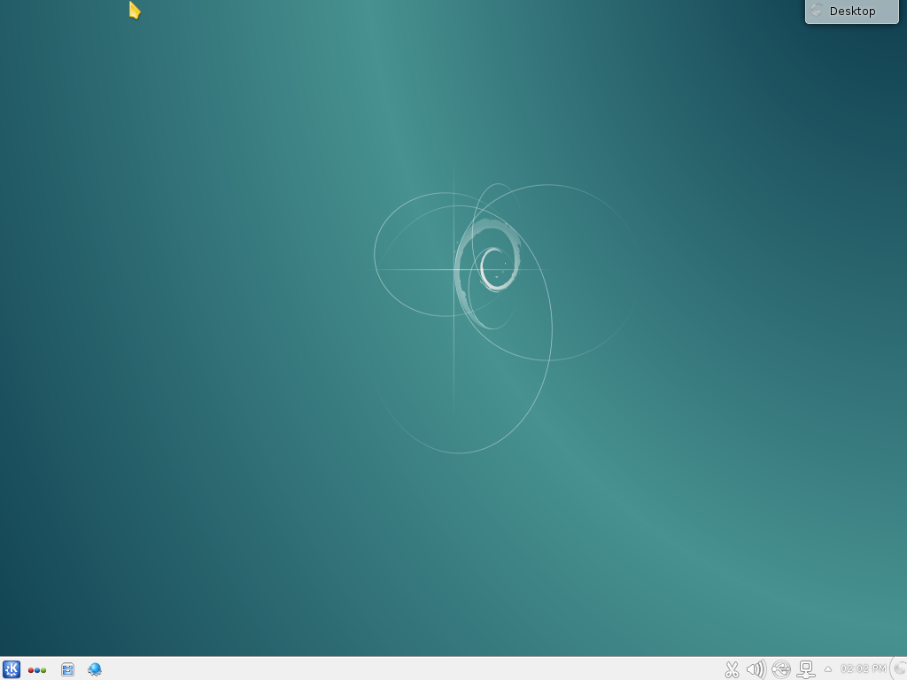
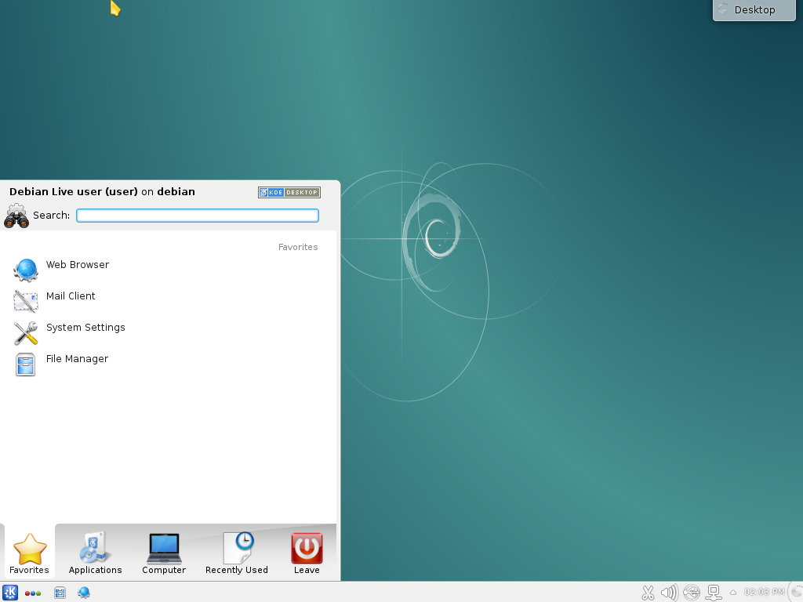
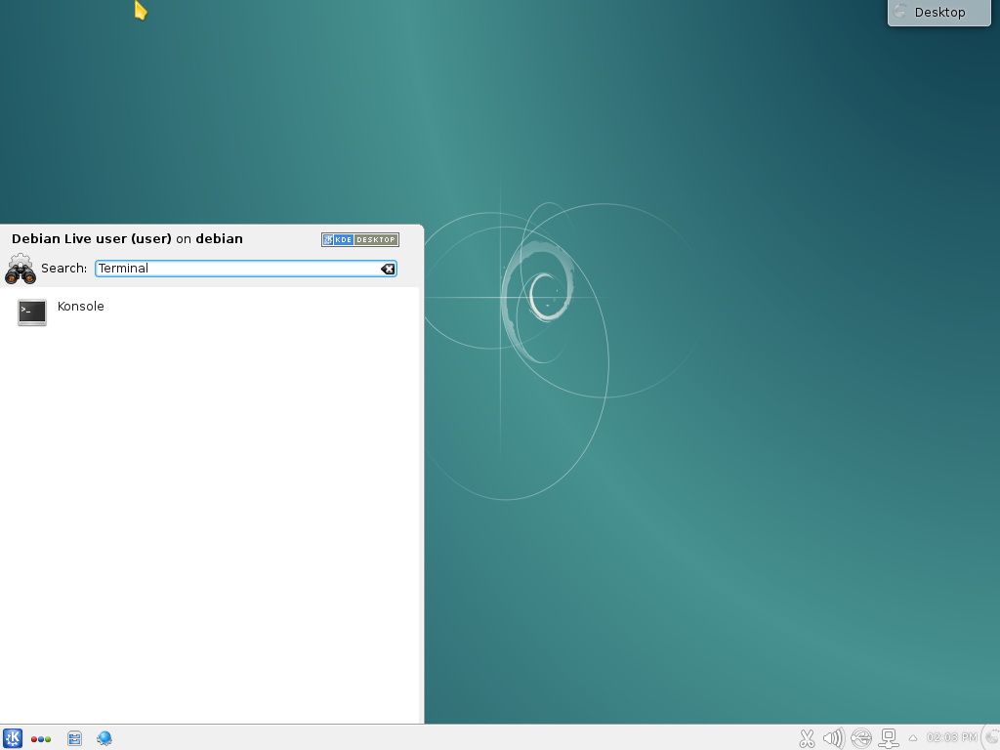
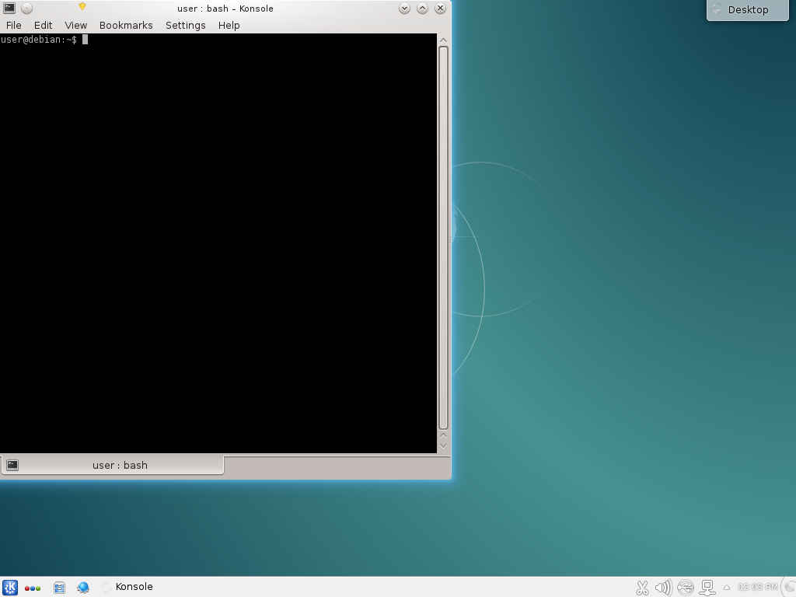

On [KDE](https://www.kde.org/), you will start with a screen like the one below.

Click on the bottom left corner of the screen
to open the start menu.

Type `Terminal` to filter the applications.

You can click on the only application listed on the start menu,
i.e. Konsole.
After a few seconds you will get a new window with your terminal.

