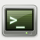

On [XFCE](http://xfce.org/), you will start with a screen like the one below.

If you click on the second item, , of the dock at the bottom of the screen
you will open the terminal.

If you don't have the dock,
you can click the "Applications Menu"
located at the top (or bottom) left corner of the screen.

On the "Applications Menu", select "Terminal Emulator".
After a few seconds you will get a new window with your terminal.

