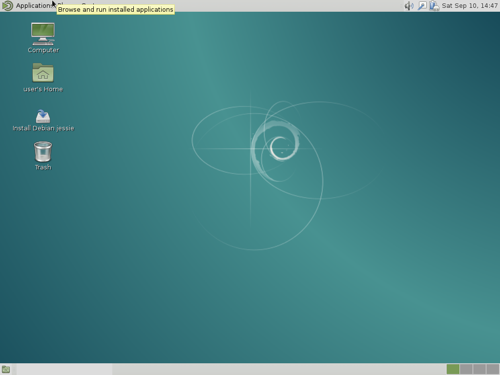
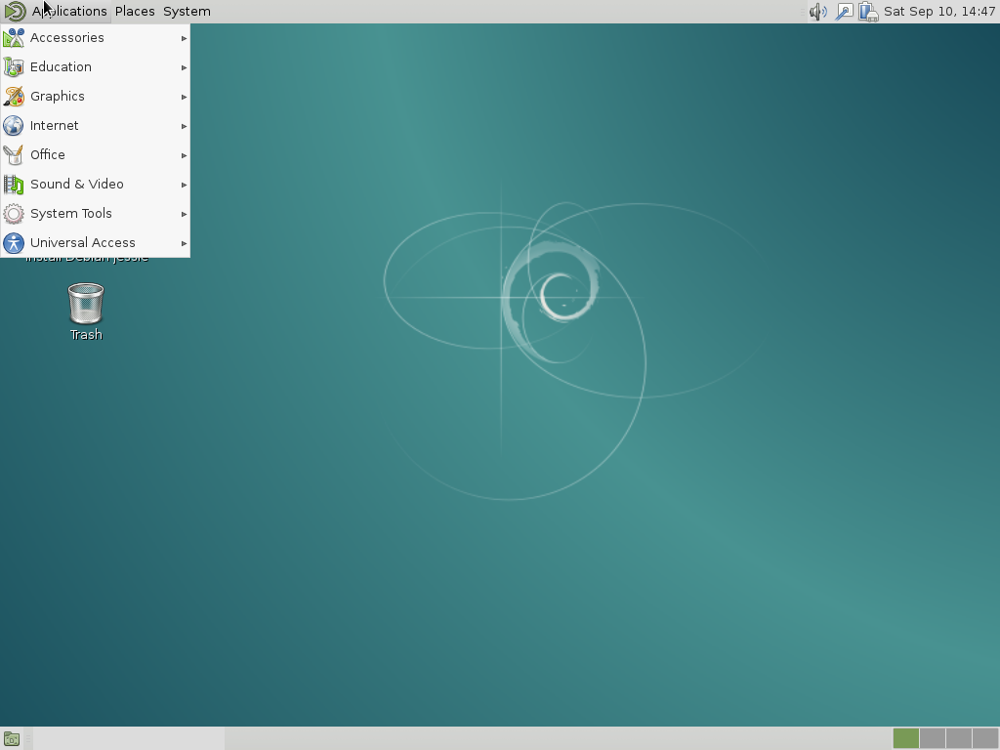
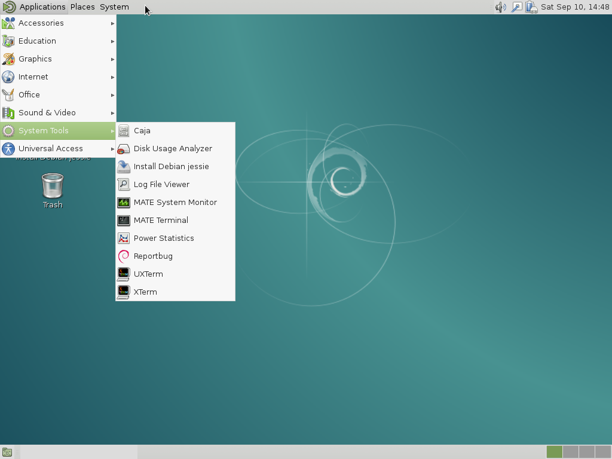
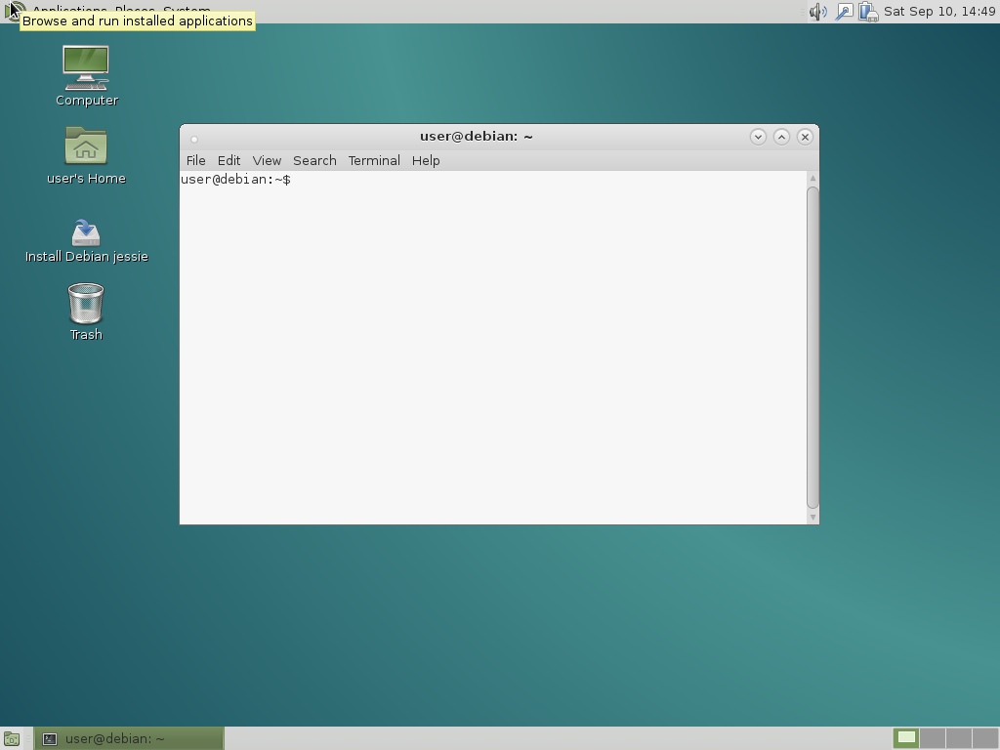

On [MATE](http://mate-desktop.com/), you will start with a screen like the one below.

Click on the tpo left corner of the screen
to open the "Applications".

Select "Stytem Tools".

You can click on the "MATE Terminal".
After a few seconds you will get a new window with your terminal.

