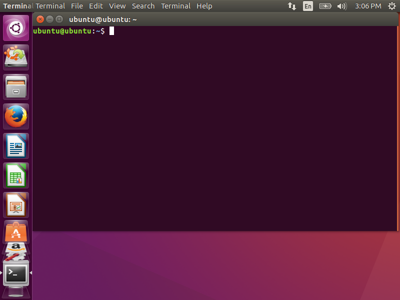

On [Ubuntu](http://www.ubuntu.com/), you will start with a screen like the one below.

Press the [super key](https://en.wikipedia.org/wiki/Windows_key) on your keyboard to open dashboard.

Type `Terminal` to filter the applications.

You can click on the application named "Terminal" on the dashboard.
After a few seconds you will get a new window with your terminal.

