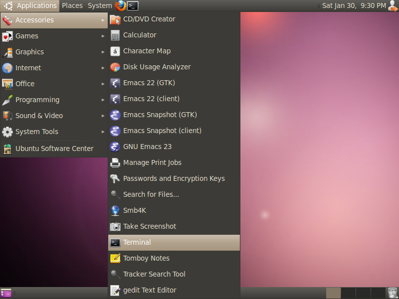
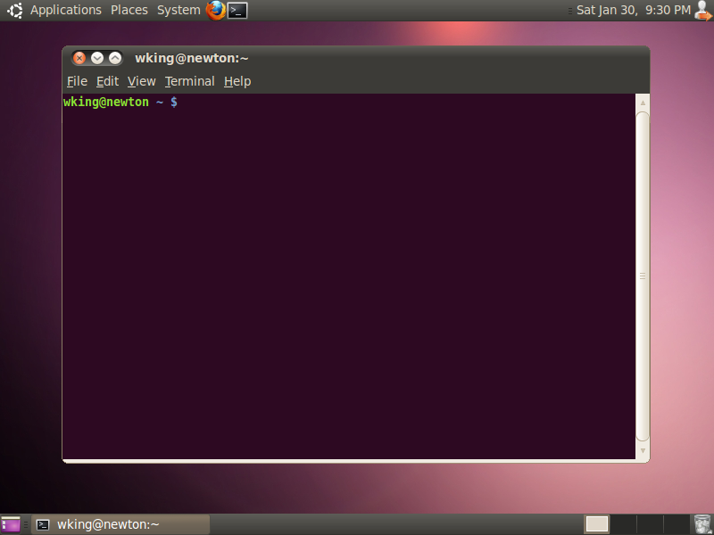

# Ubuntu

The terminal application is called "Terminal", and you can find it in
Accessories > Terminal.

To open "Terminal", click the entry.

Once you open "Terminal", it will look something like this:

